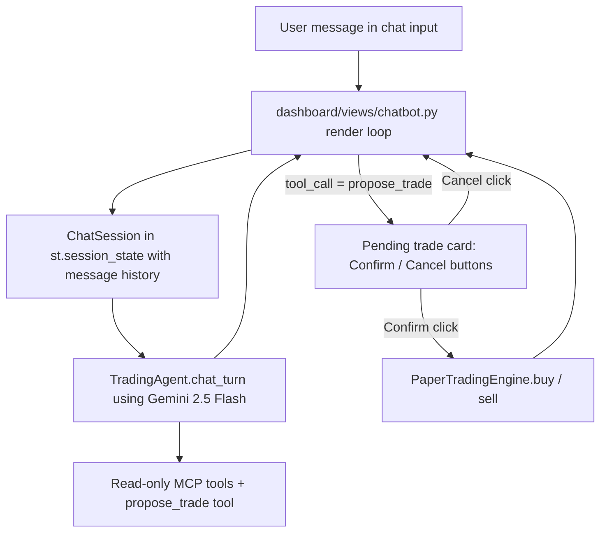

# AI Assistant Chatbot Page

## Goals

- Full conversational assistant (not the single-turn sidebar box that exists today).
- Powered by Gemini 2.5 Flash (already set via `GEMINI_MODEL = "gemini-2.5-flash"` in [config.py](config.py)).
- Can answer: stock/market questions, technical/geopolitical analysis, "how much money do I have", "what do I own".
- Can guide the user to the right page (Overview, My Portfolio, Manual Trade, Stock Analysis, Geopolitical Risk, Trade History, Backtesting, Settings).
- Can propose buy/sell trades, but every trade requires a **user click to confirm** before execution.

## Architecture

Key idea: the chatbot's Gemini tool set excludes `buy_stock` / `sell_stock` / `cancel_order`. Instead it has a `propose_trade(symbol, side, quantity, order_type, limit_price, reasoning)` tool that returns a structured dictionary. The page detects this and renders a confirmation card; only then does it call `engine.buy` / `engine.sell` directly (the same path Manual Trade uses).

## Files

### 1. New: [agent/chat_session.py](agent/chat_session.py)

A `ChatSession` class that:

- Holds `history: list[types.Content]` across turns (full Gemini chat history, persisted in Streamlit session state).
- Holds a compact `display_messages: list[{role, text, pending_trade?, tool_calls?}]` for rendering.
- `send(user_message) -> dict` returns `{"text": str, "pending_trade": dict | None, "tool_calls": list[str]}`.
  - Runs the Gemini loop (same shape as `TradingAgent.chat` in [agent/trading_agent.py](agent/trading_agent.py) lines 548-600) but:
    - Uses the new `CHATBOT_SYSTEM_PROMPT`.
    - Uses the chatbot tool set (read-only + `propose_trade`).
    - Preserves `self.history` across turns (append user msg and every `candidate.content` from each iteration).
    - Max 8 iterations per turn.
  - When a `propose_trade` function call appears, returns its args as `pending_trade` and stops further tool processing for that turn; the page will handle confirmation. The assistant's accompanying explanatory text (if any) is returned as `text`.
- `confirm_trade(pending_trade, engine) -> dict`: calls `engine.buy(...)` or `engine.sell(...)`; appends a synthetic `user` message "User confirmed trade. Execution result: {...}" back to `self.history` so follow-up questions have context.
- `cancel_trade(pending_trade) -> None`: appends "User cancelled the proposed trade." to history.
- `reset()` clears history.

Read-only tool subset (names only, reusing existing implementations from the MCP servers already imported in [agent/trading_agent.py](agent/trading_agent.py)):

- Financial: `get_stock_price`, `get_stock_history`, `get_technical_indicators`, `get_market_overview`, `search_stocks`
- Geopolitical: `get_global_news`, `get_news_sentiment`, `get_geopolitical_risk_score`, `get_region_risk`, `get_sector_impact`, `get_conflict_monitor`
- Portfolio (read): `get_portfolio`, `get_account_balance`, `get_trade_history`, `get_open_orders`
- Banking (read): `get_bank_accounts`, `get_bank_transactions`
- Alerts: `set_price_alert`, `list_alerts`, `delete_alert`, `check_alerts`
- Watchlist: `add_to_watchlist`, `remove_from_watchlist`, `get_watchlist_snapshot`
- Analytics: `scan_patterns`, `get_signal_summary`, `get_portfolio_risk_metrics`, `get_stock_risk_profile`
- New: `propose_trade` (parameters: symbol, side ["buy"|"sell"], quantity, order_type ["market"|"limit"], limit_price?, reasoning)
- Excluded: `buy_stock`, `sell_stock`, `cancel_order`, `initiate_brokerage_transfer`, `clear_watchlist`

### 2. Update: [agent/prompts.py](agent/prompts.py)

Add `CHATBOT_SYSTEM_PROMPT` that:

- Introduces the assistant as the in-app helper for an AI stock trading dashboard (paper trading).
- Lists every page with a one-line summary so the model can direct users:
  - **Overview**: account summary, risk gauge, manual "Run AI Analysis" button, autopilot controls.
  - **My Portfolio**: holdings table, allocation donut, last agent cycle feed.
  - **Manual Trade**: place buy/sell market or limit orders yourself.
  - **Stock Analysis**: charts, technical indicators, AI single-stock analysis.
  - **Geopolitical Risk**: risk gauge, conflict monitor, sector impact, news.
  - **Trade History**: filterable trades and open limit orders.
  - **Backtesting**: run strategies against historical data.
  - **Settings**: API keys, watchlist, trading parameters.
- Tells the model to use `get_portfolio` / `get_account_balance` whenever the user asks about their money or holdings, rather than guessing.
- Tells it to use `propose_trade` whenever the user asks to buy or sell, and to clearly explain reasoning before proposing. NEVER claim a trade was placed; the system will show a confirm card.
- Sets tone: concise, friendly, numbers with $ and %, cite risk score when relevant.

### 3. New: [dashboard/views/chatbot.py](dashboard/views/chatbot.py)

`def render(agent, engine, autopilot=None):`

Uses Streamlit chat primitives:

- Lazily create `ChatSession` in `st.session_state["chat_session"]` using `agent`'s existing Gemini client (pass the client + model, or construct a new `genai.Client` using `GEMINI_API_KEY`).
- Header + "Clear conversation" button (resets session state).
- Suggested starter chips (buttons) below header: e.g. "How much money do I have?", "What do I own?", "Analyze NVDA", "What's the geopolitical risk right now?", "Where can I place a manual trade?". Clicking a chip submits it as the next user message.
- Loop over `st.session_state["chat_messages"]` and render each via `st.chat_message("user"|"assistant")`. For assistant messages that carried tool calls, show a small caption like "Looked up: get_stock_price, get_portfolio".
- If `st.session_state.get("pending_trade")` is set, render an inline confirmation card inside the last assistant message:
  - Show side/quantity/symbol/order_type/(limit_price)/reasoning.
  - `st.columns(2)` with "Confirm {BUY|SELL}" (primary) and "Cancel".
  - Confirm → `engine.buy(...)` or `engine.sell(...)` with `reasoning="Chatbot-confirmed: {reason}"`, then append result as assistant message, clear `pending_trade`, `st.rerun()`.
  - Cancel → append "Trade cancelled." and clear.
  - While `pending_trade` is set, disable the chat input (or show a warning) so the user resolves it first.
- `st.chat_input` at the bottom sends to `session.send(message)` with a spinner, appends result to `chat_messages`, sets `pending_trade` if present.

### 4. Update: [dashboard/app.py](dashboard/app.py)

- Add `"AI Assistant": "chatbot"` to the `pages` dict, placed between **Overview** and **My Portfolio** (prime placement for discoverability).
- Leave the existing sidebar "Quick AI Chat" block as-is, but change its caption to "For multi-turn chat, open the **AI Assistant** page."

### 5. No changes required

- Simulator code, existing MCP servers, autopilot, or other views.

## Behavior examples

- "How much money do I have?" → agent calls `get_account_balance` → replies with cash + total + return.
- "What do I own?" → `get_portfolio` → table-like summary.
- "Buy 10 NVDA" → `propose_trade(symbol="NVDA", side="buy", quantity=10, order_type="market", reasoning="User requested")` → page shows Confirm/Cancel card; trade only happens after Confirm.
- "Where do I see my trade history?" → text answer pointing to **Trade History** page, no tool calls.
- "Analyze TSLA" → chains `get_stock_price`, `get_technical_indicators`, possibly `get_signal_summary` → narrative with key numbers.

## Testing

Run Streamlit, open **AI Assistant**:
1. Ask "how much money do I have" — expect live numbers from `get_account_balance`.
2. Ask a follow-up like "and how is NVDA today" — confirms conversation memory.
3. Say "buy 1 share of AAPL at market" — expect a proposal card with Confirm/Cancel. Click Confirm, verify Trade History shows the new trade. Separately, try Cancel and verify nothing is recorded.
4. Ask "where can I run a backtest" — expect a pointer to the Backtesting page, no tool calls.
5. Click "Clear conversation" — history resets, welcome state returns.
