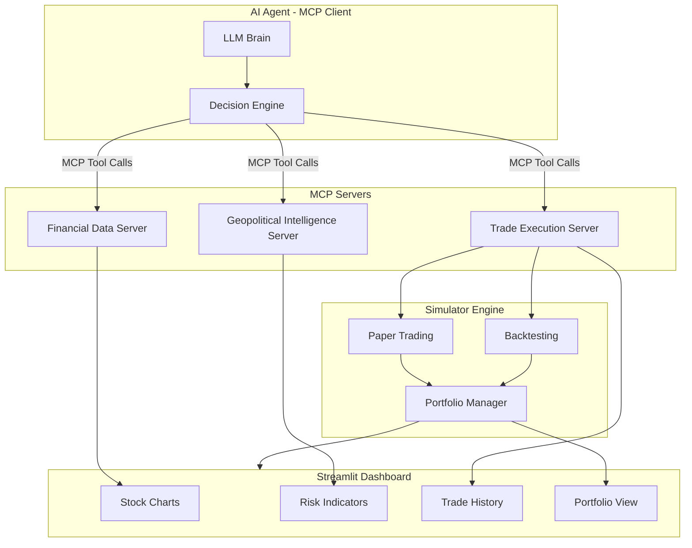
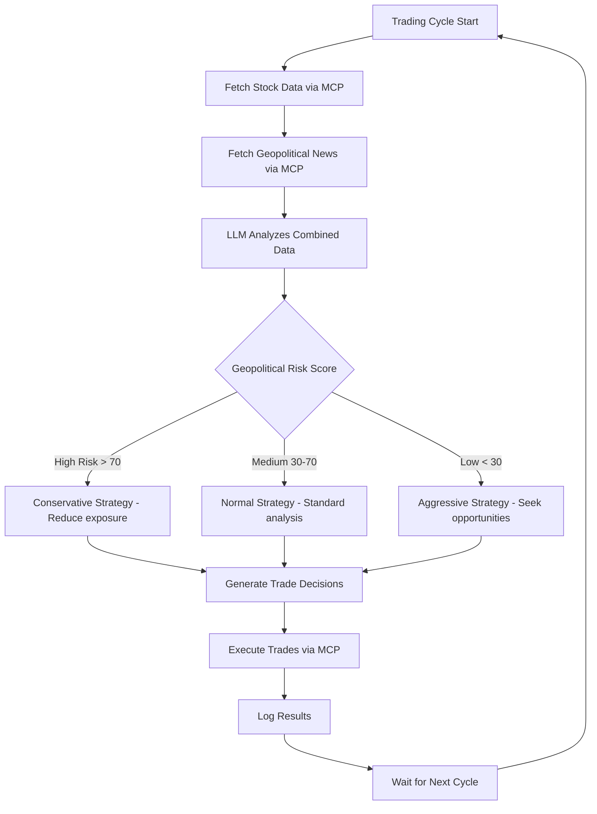

# AI Stock Trading Agent with MCP and Geopolitical Risk Analysis

## Architecture Overview

The system is composed of **3 MCP Servers**, an **AI Agent** (MCP client), a **Simulator Engine**, and a **Web Dashboard**.



## MCP Usage Strategy

MCP is the central nervous system. The AI agent (LLM) never directly calls APIs -- it only interacts through MCP tool calls. This gives us:

- **Decoupled architecture**: Swap data providers without changing the AI logic
- **Standardized interface**: All data and actions follow the MCP tool/resource pattern
- **Auditable**: Every MCP call is logged, creating a full decision trail

### MCP Server 1: Financial Data Server (`financial_data_server.py`)

Provides real-time and historical stock data via **yfinance**.

**Tools exposed:**
- `get_stock_price(symbol)` -- Current price, volume, day change
- `get_stock_history(symbol, period, interval)` -- Historical OHLCV data
- `get_technical_indicators(symbol)` -- RSI, MACD, Bollinger Bands, SMA/EMA
- `get_market_overview()` -- Major indices (S&P 500, NASDAQ, DOW)
- `search_stocks(query)` -- Search tickers by name/keyword

**Resources exposed:**
- `stock://{symbol}/price` -- Live price resource
- `stock://{symbol}/history` -- Historical data resource

### MCP Server 2: Geopolitical Intelligence Server (`geopolitical_server.py`)

Fetches global news, performs sentiment analysis, and computes a geopolitical risk score.

**Tools exposed:**
- `get_global_news(query, count)` -- Fetch latest news articles (via NewsAPI)
- `get_news_sentiment(query)` -- Aggregate sentiment score for a topic
- `get_geopolitical_risk_score()` -- Composite 0-100 risk score based on active conflicts, sanctions, trade wars
- `get_region_risk(region)` -- Risk assessment for a specific region
- `get_sector_impact(sector)` -- How geopolitical events affect a given sector (energy, tech, defense, etc.)
- `get_conflict_monitor()` -- Active global conflicts and their market impact

**How the risk score is computed:**
1. Fetch latest news from multiple categories (conflicts, sanctions, trade, elections)
2. Run sentiment analysis on each article (using the LLM itself or TextBlob/VADER)
3. Weight by recency and source reliability
4. Aggregate into a composite score (0 = calm, 100 = extreme risk)
5. Break down by region and sector

### MCP Server 3: Trade Execution Server (`trade_server.py`)

Interfaces with the simulator engine to execute and manage trades.

**Tools exposed:**
- `buy_stock(symbol, quantity, order_type, price_limit)` -- Place a buy order
- `sell_stock(symbol, quantity, order_type, price_limit)` -- Place a sell order
- `get_portfolio()` -- Current holdings with P&L
- `get_account_balance()` -- Cash balance and total portfolio value
- `get_trade_history(limit)` -- Recent trades with timestamps
- `get_open_orders()` -- Pending limit orders
- `cancel_order(order_id)` -- Cancel a pending order

## AI Agent Decision Flow



The AI agent uses an LLM (configurable: OpenAI GPT-4o, Anthropic Claude, or local models via Ollama) to:
1. **Gather** market data and geopolitical intelligence via MCP tool calls
2. **Analyze** the combined data, including technical indicators + sentiment + risk scores
3. **Decide** what to buy/sell based on a risk-adjusted strategy
4. **Execute** trades via the Trade Execution MCP server
5. **Report** results and reasoning to the dashboard

## Simulator Engine

### Paper Trading Simulator
- Starts with a configurable virtual balance (default: $100,000)
- Uses real-time stock prices from yfinance
- Tracks portfolio positions, cash balance, P&L
- Supports market orders and limit orders
- Applies simulated commission fees (configurable)

### Backtesting Simulator
- Replays historical data day-by-day
- AI agent makes decisions on each "day" using only data available up to that point
- Computes performance metrics: total return, Sharpe ratio, max drawdown, win rate
- Compares against benchmark (S&P 500 buy-and-hold)

Both simulators share a common `PortfolioManager` class that handles position tracking, P&L calculation, and order management.

## Web Dashboard (Streamlit)

A single Streamlit app (`dashboard.py`) with multiple pages:

1. **Overview** -- Portfolio value chart, daily P&L, geopolitical risk gauge
2. **Stock Analysis** -- Individual stock charts with technical indicators, news sentiment overlay
3. **Geopolitical Risk** -- World risk heatmap, conflict monitor, sector impact analysis
4. **Trade History** -- Table of all executed trades with AI reasoning
5. **Backtesting** -- Run backtests, view performance charts, compare strategies
6. **Settings** -- Configure API keys, initial balance, risk parameters, LLM provider

## Project Structure

```
project/
├── requirements.txt
├── .env.example                    # API keys template
├── config.py                       # Central configuration
├── README.md
│
├── mcp_servers/
│   ├── financial_data_server.py    # MCP Server 1: Stock data
│   ├── geopolitical_server.py      # MCP Server 2: News & risk
│   └── trade_server.py             # MCP Server 3: Trade execution
│
├── agent/
│   ├── trading_agent.py            # Main AI agent (MCP client)
│   ├── strategies.py               # Trading strategy logic
│   └── prompts.py                  # System prompts for the LLM
│
├── simulator/
│   ├── portfolio_manager.py        # Position tracking, P&L
│   ├── paper_trading.py            # Paper trading engine
│   ├── backtesting.py              # Backtesting engine
│   └── models.py                   # Data models (Order, Position, Trade)
│
├── dashboard/
│   ├── app.py                      # Streamlit main app
│   ├── pages/
│   │   ├── overview.py
│   │   ├── stock_analysis.py
│   │   ├── geopolitical_risk.py
│   │   ├── trade_history.py
│   │   ├── backtesting.py
│   │   └── settings.py
│   └── components/
│       ├── charts.py               # Plotly chart builders
│       └── widgets.py              # Reusable UI components
│
└── data/
    ├── trades.db                   # SQLite for trade history
    └── cache/                      # Cached API responses
```

## Key Dependencies

- `mcp` -- Python MCP SDK (FastMCP for server building)
- `yfinance` -- Free stock market data
- `newsapi-python` -- News article fetching
- `openai` or `anthropic` -- LLM API client
- `streamlit` -- Web dashboard
- `plotly` -- Interactive charts
- `textblob` or `vaderSentiment` -- Sentiment analysis
- `sqlalchemy` -- Database ORM for trade history
- `pandas` -- Data manipulation
- `ta` -- Technical analysis indicators library

## API Keys Required

- **NewsAPI key** (free tier: 100 requests/day) from newsapi.org
- **LLM API key** (OpenAI or Anthropic) -- or use Ollama for free local models
- No key needed for yfinance (free)
