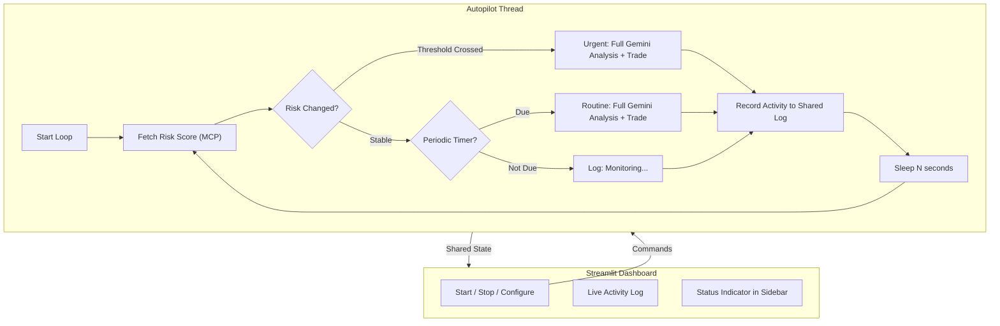

# Real-time Autonomous Trading Autopilot

## Current State

The agent only trades when the user manually clicks "Run AI Analysis Cycle" on the Overview page. There is no continuous monitoring -- geopolitical events that happen between clicks are missed.

## Architecture

A new **Autopilot** class runs in a background thread, continuously polling for geopolitical risk changes and triggering the Gemini agent to trade when conditions warrant it.



The autopilot has two trigger modes:
- **Reactive** -- risk score crosses a threshold boundary (e.g., low-to-medium, medium-to-high). Triggers an immediate full Gemini analysis cycle that can buy/sell.
- **Periodic** -- even if risk is stable, run a routine analysis every N minutes (configurable, default 5 min) to catch technical opportunities.

## Changes

### 1. New file: `agent/autopilot.py`

Core class with the following design:

- **`Autopilot`** -- owns a background `threading.Thread`
- Holds a shared `activity_log: list[dict]` that the dashboard reads
- State fields: `is_running`, `current_risk`, `previous_risk`, `last_analysis_time`
- Key methods:
  - `start()` / `stop()` -- control the thread
  - `_loop()` -- the main loop body (runs in the thread)
  - `_check_risk_transition()` -- compares `current_risk` to `previous_risk` against the thresholds in [config.py](config.py) (`RISK_THRESHOLDS: low=30, medium=70`)
  - `_run_reactive_cycle()` -- called when a threshold is crossed; uses the existing `TradingAgent.run_analysis()` with a special prompt emphasizing the risk change
  - `_run_routine_cycle()` -- called on the periodic timer; uses the standard `run_analysis()`

Configurable parameters (with defaults):
- `poll_interval_seconds` = 60 (how often to check risk)
- `routine_interval_seconds` = 300 (how often to run full analysis even if risk is stable)
- `risk_change_threshold` = 10 (minimum point change to trigger a reactive cycle, even within the same band)

The loop logic per tick:

```python
risk_data = get_geopolitical_risk_score()
new_score = risk_data["composite_score"]
band_changed = _get_band(new_score) != _get_band(self.previous_risk)
big_move = abs(new_score - self.previous_risk) >= self.risk_change_threshold

if band_changed or big_move:
    # Reactive: risk shifted meaningfully
    self._run_reactive_cycle(new_score, risk_data)
elif time_since_last_routine >= self.routine_interval:
    # Periodic routine check
    self._run_routine_cycle(new_score)
else:
    # Just log monitoring status
    self._log("monitoring", f"Risk stable at {new_score:.0f}")

self.previous_risk = new_score
```

Thread safety: uses `threading.Lock` around the activity log and `threading.Event` for clean shutdown.

### 2. New prompt in `agent/prompts.py`

Add a `REACTIVE_PROMPT` specifically for risk-triggered cycles, providing context about what changed:

```
The geopolitical risk score just changed from {prev_score} to {new_score} 
({direction}). Risk band shifted from {prev_band} to {new_band}.

Urgently reassess the portfolio. If risk increased, consider selling 
vulnerable positions and rotating to defensive assets. If risk decreased, 
look for buying opportunities in growth sectors.
```

### 3. Update `dashboard/views/overview.py`

Add an "Autopilot" section below the existing "AI Trading Agent" section:

- **Start/Stop toggle** -- `st.toggle("Enable Autopilot")`
- **Configuration row** -- poll interval slider (30-300s), routine interval slider (1-15 min)
- **Status indicator** -- green "RUNNING" / gray "STOPPED" badge
- **Live activity log** -- a scrollable container showing the last 20 autopilot actions with timestamps, risk scores, and trade decisions
- **Auto-refresh** -- uses `st.empty()` containers that update on each Streamlit rerun, plus `st_autorefresh` (or a simple `time.sleep` + `st.rerun` pattern) to poll every few seconds

### 4. Update `dashboard/app.py`

- Instantiate the `Autopilot` alongside the existing `agent` and `engine` (also under `@st.cache_resource` so it persists across reruns)
- Pass it to `view.render()` so the overview page can control it

### 5. Sidebar live status

Add a small status section in the sidebar of [dashboard/app.py](dashboard/app.py) showing:
- Autopilot: RUNNING / STOPPED
- Current risk score
- Last action timestamp

### 6. Update `config.py`

Add default autopilot settings:
```python
AUTOPILOT_POLL_INTERVAL = 60
AUTOPILOT_ROUTINE_INTERVAL = 300
AUTOPILOT_RISK_CHANGE_THRESHOLD = 10
```

## Files to Change

| File | What |
|------|------|
| `agent/autopilot.py` | New -- the core autopilot loop |
| `agent/prompts.py` | Add `REACTIVE_PROMPT` |
| `config.py` | Add autopilot defaults |
| `dashboard/app.py` | Instantiate autopilot, pass to views, sidebar status |
| `dashboard/views/overview.py` | Autopilot controls + live activity log |
