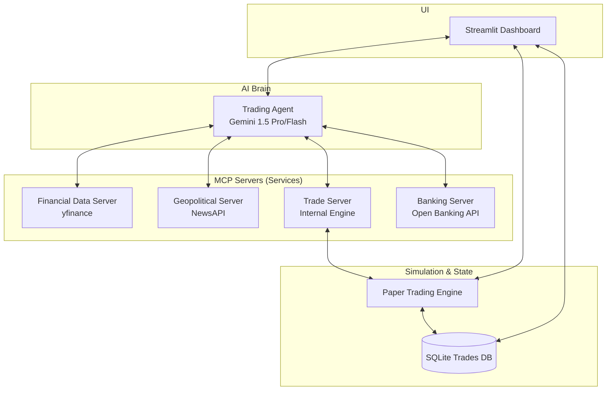

# StockTraiderAgent Developer Handoff Guide

This document provides a technical deep-dive into the AI Stock Trading Agent. It is designed for an AI coder to quickly understand the architecture, data flow, and the process for adding new services.

## 1. Architecture Overview

The system follows a decoupled, service-oriented architecture using the **Model Context Protocol (MCP)**. This allows the AI agent to interact with various data sources and execution engines through a standardized interface.



## 2. Component Deep-Dive

### 2.1 MCP Servers (`mcp_servers/`)
Each file in this directory is a standalone MCP server built with `FastMCP`.
- **Communication**: Uses JSON-RPC over `streamable-http` or `stdio`.
- **Tools**: Functions decorated with `@mcp.tool()`. These are the primary interface for the AI.
- **Resources**: Data endpoints decorated with `@mcp.resource()`.
- **Standalone Run**: Each server can be run independently (e.g., `python mcp_servers/financial_data_server.py`).

### 2.2 AI Agent (`agent/`)
The `TradingAgent` class in `trading_agent.py` is the orchestrator.
- **LLM**: Uses `google-genai` SDK to interact with Gemini models.
- **Tool Discovery**: Currently, tools are **manually registered** in the agent.
- **Execution Loop**:
    1. Agent receives a prompt.
    2. Agent decides which tools to call.
    3. `_execute_tool_call` runs the local Python function corresponding to the tool.
    4. Tool results are fed back to Gemini until a final decision is reached.

### 2.3 Simulator & State (`simulator/`)
- **`PaperTradingEngine`**: Manages the virtual portfolio, executes orders against live prices, and calculates real-time P&L.
- **`PortfolioManager`**: Handles the logic for buying/selling, position tracking, and transaction history.
- **Storage**: Uses SQLAlchemy with a SQLite backend (`data/trades.db`) to persist trade history across sessions.

## 3. How to Add a New Service (Step-by-Step)

To extend the agent with a new service (e.g., a "Social Sentiment" service), follow these steps:

### Step 1: Create the MCP Server
Create `mcp_servers/social_sentiment_server.py`:
```python
from mcp.server.fastmcp import FastMCP
import json

mcp = FastMCP("Social Sentiment Server")

@mcp.tool()
def get_tweet_sentiment(ticker: str) -> str:
    """Analyze recent tweet sentiment for a ticker."""
    # Implementation logic here
    return json.dumps({"ticker": ticker, "sentiment": "bullish", "score": 0.85})

if __name__ == "__main__":
    mcp.run()
```

### Step 2: Register Tools in `TradingAgent`
Modify `agent/trading_agent.py`:
1.  **Import** your new function in `_register_tools()`.
2.  **Add** it to the appropriate tool dictionary (e.g., `self._social_tools`).
3.  **Update** `_all_tools()` to include your new dictionary.

### Step 3: Define Gemini Tool Schema
Modify `agent/trading_agent.py`'s `_build_gemini_tools()` method. You **must** add a JSON schema entry for your tool so Gemini knows it exists and how to call it:
```python
"get_tweet_sentiment": {
    "description": "Analyze recent tweet sentiment for a ticker.",
    "params": {"ticker": {"type": "STRING", "description": "Stock symbol"}},
    "required": ["ticker"],
},
```

### Step 4: (Optional) Register in `main.py`
If you want the service to run as a standalone process in "Servers Mode", add it to the `servers` list in `main.py`:
```python
("Social Sentiment", "mcp_servers/social_sentiment_server.py"),
```

## 4. Key Files Reference

| File | Purpose |
| :--- | :--- |
| `main.py` | Entry point for Dashboard, Agent CLI, and MCP Servers. |
| `config.py` | Environment variable management (API Keys, Risk Thresholds). |
| `agent/trading_agent.py` | The main "Brain" logic and tool management. |
| `simulator/portfolio_manager.py` | Core financial logic for trade execution. |
| `dashboard/app.py` | Streamlit entry point. |

## 5. Development Tips for AI Coders

> [!IMPORTANT]
> **Manual Schema Constraint**: Do not assume the agent dynamically discovers tools. If you add an `@mcp.tool()` to a server, you **must** update the `tool_schemas` dictionary in `agent/trading_agent.py`.

> [!TIP]
> **In-Process Testing**: The `TradingAgent` is configured to call MCP tools as direct Python functions (`_execute_tool_call`). This makes debugging much easier than testing over network sockets. Always check the tool's return type; it should almost always be a JSON-serialized string.

- **Check Logs**: The system uses standard Python `logging`. Check the terminal output for real-time tool calling traces.
- **Port Management**: If running standalone, `Financial Data` is on `8001`, `Geopolitical` on `8002`, and `Trade` on `8003`.
